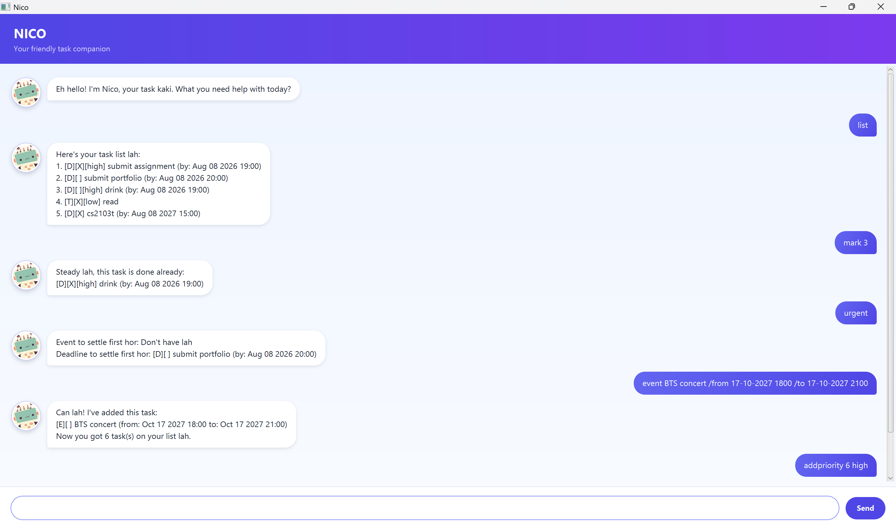

# Nico User Guide



Nico is a desktop task manager for users who prefer typing short commands. It keeps todos, deadlines, and events in one list, where you can track completion and assign priorities. Nico automatically saves changes to `data/tasks.txt` and reloads them the next time it starts.

Enter a command in the text field at the bottom of the window, then press <kbd>Enter</kbd> or select **Send**. Commands are case-sensitive and must be entered in lowercase. Dates and times use the `dd-MM-yyyy HHmm` format; for example, `25-08-2026 1900` means 25 August 2026 at 7:00 PM.

Nico displays each task with a type and status:

- `[T]`, `[D]`, and `[E]` identify todos, deadlines, and events respectively.
- `[ ]` identifies an incomplete task; `[X]` identifies a completed task.
- `[high]`, `[medium]`, or `[low]` appears when a priority has been assigned.

## Adding todos

Use `todo` to add a task that has no date or time.

Format: `todo DESCRIPTION`

Example: `todo borrow book`

Expected outcome:

```text
Can lah! I've added this task:
[T][ ] borrow book
Now you got 1 task(s) on your list lah.
```

## Adding deadlines

Use `deadline` to add a task that must be completed by a specific date and time.

Format: `deadline DESCRIPTION /by dd-MM-yyyy HHmm`

Example: `deadline return book /by 25-08-2026 1900`

Expected outcome:

```text
Can lah! I've added this task:
[D][ ] return book (by: Aug 25 2026 19:00)
Now you got 1 task(s) on your list lah.
```

## Adding events

Use `event` to add an activity with a start date-time and an end date-time.

Format: `event DESCRIPTION /from dd-MM-yyyy HHmm /to dd-MM-yyyy HHmm`

Example: `event project meeting /from 25-08-2026 1400 /to 25-08-2026 1600`

Expected outcome:

```text
Can lah! I've added this task:
[E][ ] project meeting (from: Aug 25 2026 14:00 to: Aug 25 2026 16:00)
Now you got 1 task(s) on your list lah.
```

## Listing tasks

Use `list` to display every task in the order it was added. Nico assigns each task a number for use with commands such as `mark`, `delete`, and `addpriority`.

Format: `list`

Expected outcome:

```text
Here's your task list lah:
1. [T][ ] borrow book
2. [D][ ] return book (by: Aug 25 2026 19:00)
```

## Marking tasks as complete

Use `mark` with the task number shown by `list` to mark a task as complete.

Format: `mark TASK_NUMBER`

Example: `mark 1`

Expected outcome:

```text
Steady lah, this task is done already:
[T][X] borrow book
```

## Marking tasks as incomplete

Use `unmark` to return a completed task to its incomplete state.

Format: `unmark TASK_NUMBER`

Example: `unmark 1`

Expected outcome:

```text
Okay lah, this task not done yet:
[T][ ] borrow book
```

## Deleting tasks

Use `delete` to permanently remove a task. Task numbers can change after a deletion, so use `list` again before running another command that refers to a task number.

Format: `delete TASK_NUMBER`

Example: `delete 1`

Expected outcome:

```text
Can, I've removed this task:
[T][ ] borrow book
Now you got 0 task(s) on your list lah.
```

## Finding tasks

Use `find` to display tasks whose descriptions contain a keyword. The search is case-insensitive and includes all task types and completion states.

Format: `find KEYWORD`

Example: `find book`

Expected outcome:

```text
Found these matching tasks for you lah:
- [T][ ] Borrow Book
- [D][ ] return book (by: Aug 25 2026 19:00)
```

## Assigning priorities

Use `addpriority` to assign `high`, `medium`, or `low` priority to a task. Assigning another priority to the same task replaces its current priority.

Format: `addpriority TASK_NUMBER PRIORITY`

Example: `addpriority 1 high`

Expected outcome:

```text
Can lah, I've set this task's priority to high:
[T][ ][high] borrow book
```

## Showing tasks by priority

Use `showpriority` to display all tasks with the selected priority. Completed tasks are included.

Format: `showpriority PRIORITY`

Example: `showpriority high`

Expected outcome:

```text
These tasks got priority high:
- [T][ ][high] borrow book
- [D][X][high] submit report (by: Aug 25 2026 23:00)
```

## Showing urgent tasks

Use `urgent` to display the incomplete event with the earliest start time and the incomplete deadline with the earliest due time. If multiple events or deadlines share the earliest time, Nico displays all of them. Todos and completed tasks are not included.

Format: `urgent`

Expected outcome:

```text
Event to settle first hor: [E][ ] project meeting (from: Aug 25 2026 14:00 to: Aug 25 2026 16:00)
Deadline to settle first hor: [D][ ] return book (by: Aug 25 2026 19:00)
```

## Exiting Nico

Use `bye` to exit Nico. All earlier changes have already been saved automatically.

Format: `bye`

Expected outcome:

```text
Okay lah, see you again! Take care hor!
```

## Command summary

| Action | Command |
| --- | --- |
| Add a todo | `todo DESCRIPTION` |
| Add a deadline | `deadline DESCRIPTION /by dd-MM-yyyy HHmm` |
| Add an event | `event DESCRIPTION /from dd-MM-yyyy HHmm /to dd-MM-yyyy HHmm` |
| List all tasks | `list` |
| Mark a task complete | `mark TASK_NUMBER` |
| Mark a task incomplete | `unmark TASK_NUMBER` |
| Delete a task | `delete TASK_NUMBER` |
| Find tasks by keyword | `find KEYWORD` |
| Assign or replace a priority | `addpriority TASK_NUMBER PRIORITY` |
| Show tasks with a priority | `showpriority PRIORITY` |
| Show the earliest incomplete event and deadline | `urgent` |
| Exit Nico | `bye` |
